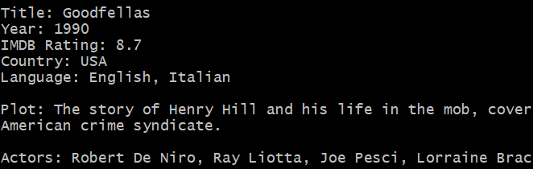
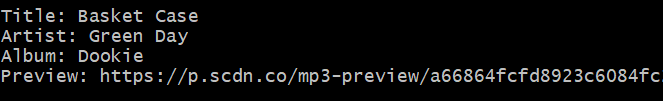

# LIRI

LIRI is a command line application written in Node.js that allows you to quicky look up movie, song and concert information.

## Installation

LIRI uses multiple modules and APIs

```bash
npm i node-spotify-api
npm i dotenv
npm i moment
npm i axios
```

## Input
```bash
node liri concert-this [band name]
```
## Output

## Input
```bash
node liri movie-this [movie title]
```
## Output

## Input
```bash
node liri spotify-this-song [song title]
```
## Output

## Input
```bash
node lirl do-what-it-says
```
## Output

